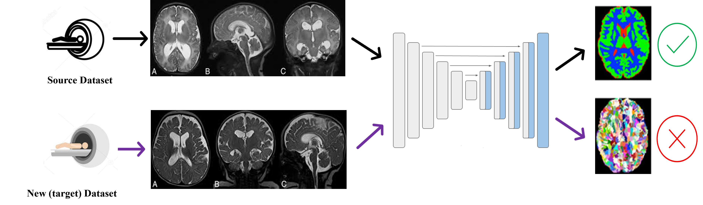

# Brain MRI Segmentation Playground

## Prerequisites 
- Linux
- Python 3.8
- PyTorch
- NVIDIA GPU

## Getting started
### Instalation
- Clone this repo
- Install the requirements

### Dataset
The CC-359 dataset is available at this [website](https://www.ccdataset.com/).